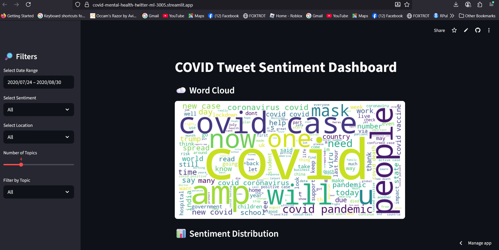
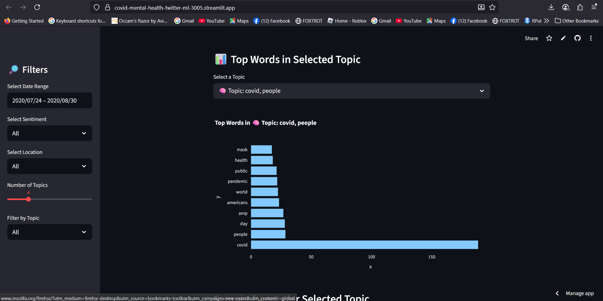
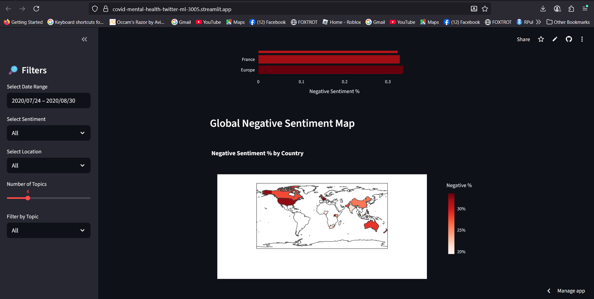

## COVID-19 Mental Health Twitter Dashboard

This is a Streamlit dashboard for visualizing and exploring sentiment in tweets related to mental health during the COVID-19 pandemic. It includes filtering, word clouds, time series analysis, topic modeling with LDA, and location-based sentiment visualization.

---

###  Project Structure

```
covid-mental-health-twitter-ml/
├── data/
│   └── sample_with_sentiment.csv   # Preprocessed tweet data with sentiment labels
├── dashboard/
│   └── app.py                      # Streamlit dashboard app
├── models/                         # (Optional) ML models for prediction
├── requirements.txt
└── README.md
```

---

### Features

- Filter tweets by date, sentiment, and country
- Generate dynamic word clouds
- View sentiment distribution over time
- Visualize global sentiment using maps and charts
- Explore key topics using LDA topic modeling
- Enter your own tweet to predict sentiment (basic ML model)

---

## Setup Instructions

### 1. Clone the repository

```bash
git clone https://github.com/saaahilo/covid-mental-health-twitter-ml.git
cd covid-mental-health-twitter-ml
```

---

### 2. (Optional but Recommended) Create and activate virtual environment

```bash
# For Windows
python -m venv venv
venv\Scripts\activate

# For macOS/Linux
python3 -m venv venv
source venv/bin/activate
```

---

### 3. Install the required packages

```bash
pip install -r requirements.txt
```

If you get errors, you may try installing key packages individually:

```bash
pip install streamlit pandas plotly matplotlib wordcloud scikit-learn
```

---

### 4. Run the Streamlit App

```bash
cd dashboard
streamlit run app.py
```

Then open [http://localhost:8501](http://localhost:8501) in your browser.

---

## Data Format

The dataset (`data/sample_with_sentiment.csv`) should include at least the following columns:

- `date` — datetime of the tweet
- `text` — raw tweet text
- `clean_text` — preprocessed tweet text
- `sentiment_label` — sentiment category (Positive, Neutral, Negative)
- `user_location` — raw location
- `location_clean` — cleaned country-level location

---

## Topic Modeling (LDA)

The app includes unsupervised topic modeling using Latent Dirichlet Allocation (LDA) to discover common themes in filtered tweets.

- The user can select number of topics
- View top words per topic
- See example tweets by topic
- Filter tweets by detected topic

---

## Sentiment Prediction (Extra)

You can enter a new tweet into a text box, and a trained model will predict the sentiment (Positive / Neutral / Negative).

This uses a basic `TfidfVectorizer` + `MultinomialNB` pipeline trained on the same dataset.

---

## Location-Based Maps

- Select sentiment type (positive, neutral, or negative)
- Shows top 10 countries by sentiment %
- Choropleth map shows sentiment intensity globally
- Color-coded maps:
  - Green → Positive
  - Blue → Neutral
  - Red → Negative

---

## Notes

- The app samples ~2000 tweets for LDA to stay performant on Streamlit Cloud.
- On first run, Streamlit may take a few seconds to load.
- If you host it on Streamlit Cloud, ensure the `/data` folder and file is uploaded.

---

## Example Usage

1. Select date range → February to March 2021  
2. Filter by **Negative** sentiment  
3. View time trends, top countries, word cloud  
4. Switch to **Topic Modeling** tab  
5. Discover what people are talking about  
6. Enter a tweet in the box to test sentiment prediction

---

## Todo / Optional Enhancements

- Improve the ML model with deep learning
- Add interactive map with tooltips
- Log user predictions anonymously
- Export filtered tweets
- Add monthly reports
- Use Twitter API for real-time data (Rate-limited)

---

## 📄 License

This project is for educational purposes. Data is anonymized and not used for commercial gain.

## Dashboard Screenshots

### 1. Overall Dashboard View


### 2. Topic Modeling (LDA)


### 3. Sentiment Map



 
